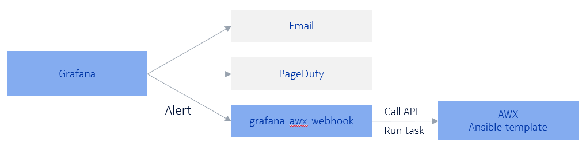

# grafana-awx-webhook
A webhook for grafana alert to trigger AWX ansible template. It receive grafana alert, and call AWX API to trigger AWX template base on alert configuration. It can used for automatic maintenance.

## Usage

